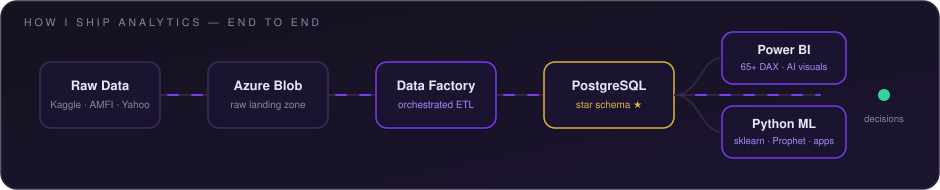

  

&nbsp;
&nbsp;<!-- TODO: point at the live portfolio once deployed -->

## `01` — About

I take data the whole way: **ingestion → Azure pipelines → SQL star schemas → Power BI dashboards → ML models** — and I lead every dashboard with one quantified headline, not a wall of charts.

**2+ years inside BFSI** selling and servicing insurance products before analyzing them — now a freelance Data Analyst with **Finonus Capital**. B.Com graduate, **Microsoft (PL-300 · AZ-900 · DP-900) and AWS certified**.

> *The kind of analyst who measures e-commerce retention on `customer_unique_id` — the real person — and flags a dataset cut-off artifact before anyone misreads it as a downturn.*

**Domains:** Finance & Insurance · Healthcare · E-Commerce &nbsp;|&nbsp; **Seeking:** Data Analyst · BI Developer · Power BI Developer

## `02` — How I Ship Analytics

## `03` — Featured Work

<table>
  <tr>
    <td width="50%" align="center">
      
      <b>558,211 Medicare claims · 226× fraud finding</b> 
      Azure ADF → PostgreSQL (9 tables) → scikit-learn (90.1% recall, AUC 0.9573) → 4-page Power BI
    </td>
    <td width="50%" align="center">
      
      <b>9M+ NAV rows · 10,571 funds · 51 AMCs</b> 
      5-dim/4-fact star schema · Sharpe/Sortino/alpha-beta suite · Prophet 30/60/90-day forecasts · Streamlit
    </td>
  </tr>
  <tr>
    <td width="50%" align="center">
      
      <b>112,650-record warehouse · 40+ DAX measures</b> 
      ~97% one-time buyers uncovered on the correct customer grain · AI visuals · what-if price simulation
    </td>
    <td width="50%" align="center">
      
      <b>RFM + 3 clustering models · Silhouette 0.52</b> 
      K-Means vs Hierarchical vs DBSCAN · CLV & cohorts · <a href="https://customer-segmentation-g4vjra3jvttxstxguxhnff.streamlit.app/"><b>🟢 Live Streamlit app</b></a>
    </td>
  </tr>
</table>

## `04` — Toolkit

   

    

     

   

## `05` — Credentials

<!-- Keep CFA Investment Foundations & HackerRank SQL ONLY if completed — delete otherwise -->

## `06` — GitHub Pulse

&nbsp;

<!--
🐍 CONTRIBUTION SNAKE (optional, 2-min setup — snake.yml already provided):
1. Add snake.yml at .github/workflows/snake.yml in this repo
2. Settings → Actions → General → Workflow permissions → "Read and write"
3. Actions tab → "generate snake" → Run workflow
4. Then UNCOMMENT below:

  <picture>
    <source media="(prefers-color-scheme: dark)" srcset="https://raw.githubusercontent.com/Skpkush/Skpkush/output/github-snake-dark.svg"/>
    
  </picture>

-->

