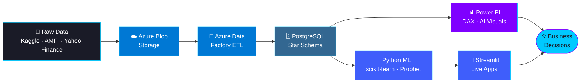

<!-- TODO: point this at the portfolio site once it's live -->

 

 

## 🚀 About Me

- 📊 I take data **end-to-end**: ingestion → Azure cloud pipelines → SQL star schemas → Power BI dashboards → ML models
- 🏦 **2+ years inside BFSI** — insurance products, customers and claims, now analyzed as a freelance Data Analyst @ **Finonus Capital**
- 🎓 B.Com graduate · **Microsoft PL-300 / AZ-900 / DP-900 + AWS certified**
- 🌍 Domains: **Finance & Insurance · Healthcare · E-Commerce**
- 🎯 Currently seeking: **Data Analyst · BI Developer · Power BI Developer** roles

<b>🎯 What I bring to a Data Analyst team (click to expand)</b>

 

- **End-to-end ownership** — I don't hand off between pipeline, model and dashboard; I ship all three
- **Honest analytics** — e.g. measuring e-commerce retention on `customer_unique_id` (the real person) instead of `customer_id`, and flagging dataset cut-off artifacts before anyone misreads a "downturn"
- **Business-first findings** — every dashboard leads with a quantified headline (226× fraud concentration, ~97% one-time buyers), not a wall of charts
- **Domain fluency** — I've sold and serviced the financial products I now analyze

---

## ⚙️ How I Ship Analytics

---

## 🛠️ Tech Stack

  

---

## 🌟 Featured Projects

 

| 💼 Project | 📏 Scale | 🏆 Headline Result | 🔗 |
|:---|:---|:---|:---|
| 🏥 **Healthcare Fraud Detection** | 558,211 claims · 5,410 providers · 9-table schema | **226× fraud concentration** in top billing quartile · ML recall **90.1%**, AUC **0.9573** | [Repo](https://github.com/Skpkush/Healthcare-Insurance-Claims-Analytics) |
| 📈 **Mutual Fund Analytics Platform** | 9M+ NAV rows · 10,571 funds · 51 AMCs | Full risk-metric suite + **Prophet 30/60/90-day forecasts** · 5-dim/4-fact star schema | [Repo](https://github.com/Skpkush/mf-analytics-platform) |
| 🛒 **Olist E-Commerce Dashboard** | 112,650-record fact table · 40+ DAX | **~97% one-time buyers** uncovered on the correct customer grain · 91.88% on-time delivery | [Repo](https://github.com/Skpkush/Olist-E-Commerce-Analytics-Dashboard) |
| 👥 **Customer Segmentation (RFM+ML)** | ~541K transactions · 3 clustering models | K-Means wins at **Silhouette 0.52** · CLV + cohort strategy per segment | [🟢 Live App](https://customer-segmentation-g4vjra3jvttxstxguxhnff.streamlit.app/) · [Repo](https://github.com/Skpkush/Customer-Segmentation) |

---

## 📜 Certifications

<!-- Keep CFA Investment Foundations & HackerRank SQL ONLY if completed — delete otherwise -->

---

## 📊 GitHub Analytics

&nbsp;

  

  

<!--
🐍 CONTRIBUTION SNAKE (optional, 2-min setup):
1. Add the provided snake.yml to this repo at .github/workflows/snake.yml
2. Repo Settings → Actions → General → Workflow permissions → "Read and write"
3. Actions tab → "generate snake" → Run workflow (runs daily after that)
4. Then UNCOMMENT the block below:

  <picture>
    <source media="(prefers-color-scheme: dark)" srcset="https://raw.githubusercontent.com/Skpkush/Skpkush/output/github-snake-dark.svg"/>
    
  </picture>

-->

---

## 🤝 Let's Connect

**🟢 Open to Data Analyst · BI Developer · Power BI Developer roles**

